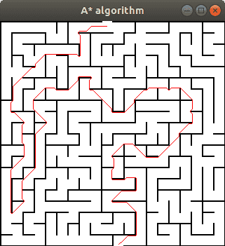

# PreLevelMap
Прототип проекта "карта уровня игры".
Пока что есть только лабиринт и поиск короткого пути.
Нужно ещё сделать игру.

## Параметры

Если мы хотим найти путь на картинке `maze.png` от координат 1 и 2 до 100 и 150 мы пишем:

```sh
  $ ./PreLevelMap maze.png 1 2 100 150
```

## Пример вывода

